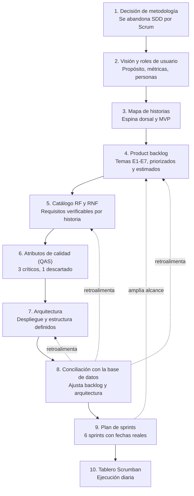

# Proceso de planificación del proyecto

Resume, en orden real, los pasos seguidos para planificar este proyecto y cómo cada uno
influyó en los siguientes. No es un proceso puramente lineal: los pasos 8 y 9
**retroalimentan** hacia pasos anteriores.

## Cómo influyó cada paso en el siguiente

| Paso | Qué produjo | Cómo influyó en lo que vino después |
|---|---|---|
| **1. Decisión de metodología** | Marco (Scrum), stack confirmado (Flutter + FastAPI), alcance núcleo (gestión de OTs) | Fijó las reglas del juego para todo lo demás: sin esto no había backlog ni sprints que planificar |
| **2. Visión y roles** ([`vision-y-roles.md`](scrum/discovery/vision-y-roles.md)) | Propósito del producto, condiciones de satisfacción del release, roles con personas | Dio el "por qué" y el "para quién" que el mapa de historias necesita para ordenar actividades |
| **3. Mapa de historias** ([`user-story-map.md`](scrum/discovery/user-story-map.md)) | Espina dorsal (secuencia de actividades) + esqueleto ambulante (MVP mínimo) | De aquí salieron los **temas E1–E7**, la agrupación que organiza el Product Backlog |
| **4. Product backlog** ([`product-backlog.md`](scrum/product-backlog.md)) | 24 historias organizadas por tema, priorizadas (MoSCoW), estimadas en puntos | Es la lista que el catálogo de requisitos debe cubrir y que el plan de sprints debe repartir |
| **5. Catálogo RF/RNF** ([`rf-rnf.md`](scrum/rf-rnf.md), [`historias-usuario.md`](scrum/historias-usuario.md)) | 53 requisitos verificables, ligados a cada historia (matriz de cobertura) | Los RNF (calidad) alimentan directamente el análisis de atributos de calidad |
| **6. Atributos de calidad — QAS** ([`quality-attributes.md`](arquitectura/quality-attributes.md)) | 3 atributos críticos (disponibilidad, mantenibilidad, integridad) y la escalabilidad descartada como driver | Es el insumo que decide la arquitectura; sin esto, elegir monolito frente a microservicios sería arbitrario |
| **7. Arquitectura** ([`justificante.md`](arquitectura/justificante.md)) | Despliegue (monolito modular) y estructura (hexagonal + vertical slicing en backend; Clean Architecture + MVVM offline-first en móvil) | Fija cómo se organiza el código de cada historia y qué exige la Definition of Done |
| **8. Conciliación con la base de datos** ([`conciliacion.md`](conciliacion.md)) — *pivote* | Detectó que el backlog, los RF y la arquitectura asumían cosas que la base de datos no tenía | **Retroalimenta hacia atrás**: reescribió estados de la OT, campos del cierre y ajustó la arquitectura — sin esto se habría planificado algo que no se podía construir |
| **9. Plan de sprints** ([`sprint-plan.md`](scrum/sprint-plan.md)) | 6 sprints con fechas reales, según el calendario real del autor | **También retroalimenta hacia atrás**: al ubicar import/export y comunicados en sprints, el backlog se amplió (de "trabajo futuro" a comprometido) |
| **10. Tablero Scrumban** ([`trello-setup.md`](scrum/trello-setup.md), [`trello-cards.md`](scrum/trello-cards.md)) | Traducción del backlog a tarjetas ejecutables | Capa de ejecución diaria; si algo se replanifica ahí, vuelve a alimentar el backlog |

## Por qué no es lineal

Un plan de una sola pasada asume que cada documento queda bien a la primera. Aquí, los
pasos 8 y 9 **corrigieron** documentos ya escritos:

- La conciliación (8) encontró que el esquema de base de datos no sostenía varios
  supuestos de los RF y de la arquitectura (estados de la OT, turno, pasos fijos,
  autenticación), y esas correcciones se propagaron hacia atrás.
- El plan de sprints (9), al ubicar el trabajo en el calendario real, reveló que dos
  temas dados por "futuro" (Comunicados, Importación/exportación) sí entraban en la
  entrega — lo que obligó a reabrir el backlog.

Esto es coherente con Scrum: el backlog se **refina continuamente**, no se congela tras
la primera planificación.
