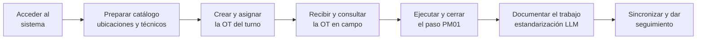

# User Story Map — Maintenance App

Técnica: **mapa de historias (story map)**, descrita por Cohn en *Succeeding with Agile*
(quien la atribuye a Jeff Patton). Ordena el trabajo en dos ejes:

- **Espina dorsal (eje horizontal):** las actividades del usuario en el orden en que
  ocurren de principio a fin. Es la narrativa del sistema.
- **Cuerpo (eje vertical):** las historias bajo cada actividad, apiladas de mayor a
  menor prioridad.
- **Línea de release:** una raya horizontal. Todo lo que queda **por encima** es el
  MVP de esta entrega. Lo de **abajo** es trabajo futuro.

Deriva de [Visión y roles de usuario](vision-y-roles.md) y alimenta el
[Product Backlog](../product-backlog.md) y el [Plan de Sprints](../sprint-plan.md).

## Espina dorsal (flujo narrativo)

## Mapa completo

Columnas = actividades de la espina dorsal. Filas = bandas de prioridad.
`▲ LÍNEA DE RELEASE` separa el MVP del trabajo futuro.

| Sprint | A. Acceder | B. Preparar catálogo | C. Crear y asignar OT | D. Recibir / consultar | E. Ejecutar y cerrar paso | F. Documentar (LLM) | G. Sincronizar / seguimiento |
|---|---|---|---|---|---|---|---|
| **S1** · base + acceso | HU-01 Login + roles | HU-02 Crear técnico · HU-04 Registrar ubicación técnica | — | — | — | — | — |
| **S2** · OTs + offline | — | — | HU-05 Crear OT + pasos · HU-06 PM01 obligatorio | HU-07 Listar mis OTs · HU-08 Detalle (→ `en progreso`) · HU-10 Dashboard del grupo | HU-09 Registrar cierre PM01 · HU-14 Cola local (Drift) | — | HU-09 → OT `cerrada` · HU-15 Sync al reconectar |
| **S3** · LLM | — | — | — | — | HU-11 Estandarizar · HU-12 Revisar/editar · HU-13 Degradación | HU-11–13 | — |
| **S4** · import/export | — | HU-22 Importar desde Excel | — | HU-23 Exportar listado de OTs | — | — | HU-24 Exportar reporte de cierres |
| **S5** · comunicados | — | — | HU-20 Enviar comunicado | HU-21 Ver comunicados vigentes | — | — | — |
| **S6** · pruebas con usuarios | recorrido completo por rol · incidencias · métricas de flujo |||||||
| ▲ **LÍNEA DE RELEASE** | ▲ | ▲ | ▲ | ▲ | ▲ | ▲ | ▲ |
| **Trabajo futuro** (E5) | HU-16 Rol Administrador · Gestión de Supervisores | — | — | HU-17 Dashboard carga por técnico · HU-18 Reporte por ubicación · horas trabajadas | — | Métricas de calidad de estandarización | — |

## El "esqueleto ambulante" (walking skeleton)

La rebanada más delgada que recorre toda la espina dorsal y ya entrega valor:

> **HU-01 → HU-04 → HU-05 → HU-07 → HU-08 → HU-09 → HU-11**

Cruza los Sprints 1 a 3. Si algo se cae del alcance, esta rebanada es intocable: sin ella no hay demo.

## Cómo se leyó para planificar

1. Se recorrió la espina dorsal con el cliente (supervisor de Mantenimiento) para
   validar el orden de las actividades.
2. Bajo cada actividad se colocaron las historias del Product Backlog.
3. Se trazó la línea de release dejando por encima solo lo necesario para demostrar
   el objetivo end-to-end en la fecha de entrega.
4. Las bandas por sprint reparten el alcance en incrementos de 1 a 3 semanas, respetando
   que cada sprint deje algo demostrable (ver [`../sprint-plan.md`](../sprint-plan.md)).
