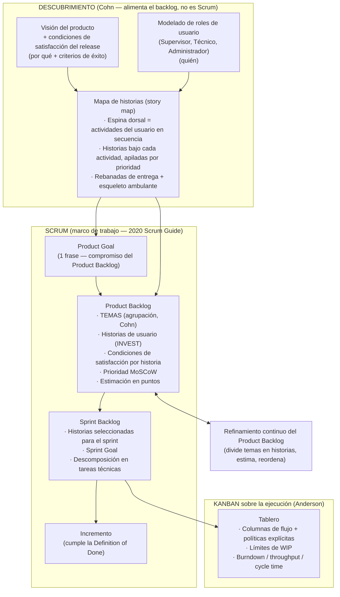

# Metodología de planificación del desarrollo

Documento de referencia para el Capítulo 3 (Marco Metodológico). Explica **qué artefacto
pertenece a qué técnica**, en qué orden se producen y **de dónde salen los temas
(épicas)** ahora que el proyecto ya no usa SDD (Spec-Driven Development).

**Bibliografía base (5 fuentes, sin agregar más):**

- *The 2020 Scrum Guide* — Schwaber & Sutherland
- *User Stories Applied* — Mike Cohn (2004)
- *Agile Estimating and Planning* — Mike Cohn (2005)
- *Succeeding with Agile* — Mike Cohn (2009)
- *Kanban: Successful Evolutionary Change for Your Technology Business* — David J. Anderson (2010)

Todo el flujo de planificación se apoya únicamente en estas fuentes. Las técnicas que no
estaban cubiertas por ellas (Impact Mapping) se retiraron y se reemplazaron por
equivalentes que sí lo están (ver §7).

---

## 1. Idea central

**Scrum es el marco de trabajo.** No define cómo descubrir ni cómo escribir los
requerimientos; solo define artefactos (Product Backlog, Sprint Backlog, Incremento),
eventos (Sprint Planning, Daily, Review, Retrospectiva) y responsabilidades
(Product Owner, Scrum Master, Developers).

Alrededor de Scrum se usan **técnicas complementarias** para llenar ese vacío, todas
tomadas de la bibliografía:

| Capa | Técnica | Aporta | Fuente |
|---|---|---|---|
| Descubrimiento — por qué | **Visión del producto** + **condiciones de satisfacción del release** | Propósito del producto y criterios de éxito de alto nivel | Cohn, *Succeeding with Agile*; Cohn, *Agile Estimating and Planning* |
| Descubrimiento — quién | **Modelado de roles de usuario** (roles, atributos, personas) | Los usuarios del sistema y sus diferencias | Cohn, *User Stories Applied* (cap. "User Role Modeling") |
| Descubrimiento — qué y en qué orden | **Mapa de historias (story map)**: actividades del usuario en secuencia + historias apiladas por prioridad | La espina dorsal del producto; de aquí salen los temas | Cohn, *Succeeding with Agile* (describe el story map y atribuye la técnica a Jeff Patton) |
| Especificación | **Historias de usuario** ("Como \<rol\>, quiero \<meta\>, para \<beneficio\>") + criterio **INVEST** | Unidad de valor negociable y verificable | Cohn, *User Stories Applied* |
| Especificación | **Condiciones de satisfacción / pruebas de aceptación** por historia | Definición comprobable de "hecho" para cada historia | Cohn, *User Stories Applied*; Cohn, *Agile Estimating and Planning* |
| Priorización | **MoSCoW** (Must / Should / Could / Won't) | Orden por necesidad | Cohn, *Agile Estimating and Planning* (cap. de priorización; la lista entre los esquemas disponibles) |
| Estimación | **Puntos de historia**, **planning poker**, **velocidad** | Esfuerzo relativo y capacidad por iteración | Cohn, *Agile Estimating and Planning* |
| Marco | **Scrum**: Product Backlog, Sprint Backlog, Incremento, Product Goal, Sprint Goal, Definition of Done, eventos, responsabilidades | El proceso | *2020 Scrum Guide* |
| Gestión del flujo | **Kanban** sobre el proceso Scrum: visualizar, **limitar el WIP**, hacer explícitas las políticas, gestionar el flujo, medir (cycle time, throughput) | Control de trabajo en curso y métricas de flujo | Anderson, *Kanban* |
| Acuerdo de equipo | **Definition of Ready** (entrada) / **Definition of Done** (salida) | Puertas de calidad | DoD: *2020 Scrum Guide* (compromiso del Incremento). DoR: práctica de equipo derivada de INVEST (Cohn) y de la idea de "trabajo listo" de Anderson |

> Para la defensa: Scrum es el marco; la visión, el modelado de roles, el story map, las
> historias, INVEST, MoSCoW y la estimación relativa son **técnicas de apoyo tomadas de
> Cohn**; Kanban se superpone para el flujo. Esto demuestra que se entienden los límites
> del Scrum Guide.

---

## 2. El flujo de artefactos

**Orden de producción (una sola vez, al inicio):**
`Visión + roles de usuario → Mapa de historias → Product Goal → Product Backlog`

**Orden de producción (cada sprint):**
`Sprint Planning → Sprint Backlog (+ Sprint Goal) → tablero Kanban → Incremento → Review / Retrospectiva → refinamiento del Product Backlog`

---

## 3. ¿De dónde salen los temas (épicas)? (sin SDD, sin specs)

### Qué eran en SDD
En el intento anterior el alcance se descomponía en **Specs**: carpetas
`specs/001-user-management/`, `specs/002-ot-management/`, … cada una con un `spec.md`
formal, generado y aprobado por el pipeline `/speckit-specify`. La "épica" era, de hecho,
una carpeta de especificación.

**Eso se elimina.** En Scrum no existen los specs ni ese pipeline.

### Terminología de Cohn: *tema* vs. *épica*
En *User Stories Applied*, Cohn distingue:

- **Épica (epic):** una **historia de usuario grande**, que por su tamaño se dividirá en
  varias historias más pequeñas antes de entrar a un sprint.
- **Tema (theme):** una **colección de historias relacionadas** (por ejemplo, por área
  funcional).

Lo que en este proyecto se rotula `E1`–`E5` son **temas** en el sentido de Cohn: grupos
de historias por área. El término "épica" se conserva en tableros y nombres cortos como
sinónimo operativo, pero en el Capítulo 3 se usa **tema** para ser precisos.

El *2020 Scrum Guide* no menciona ni temas ni épicas: solo habla de *Product Backlog
Items*. Los temas son una **capa de organización opcional** sobre el Product Backlog
(Cohn), útil aquí porque hay 24 historias que conviene agrupar y trazar contra los
objetivos.

### De dónde se justifican los temas de ESTE proyecto
Los temas **emergen del descubrimiento**, no de los specs:

1. **De la espina dorsal del mapa de historias.** El backbone son las actividades del
   usuario en orden narrativo:

   `Acceder → Preparar catálogo → Crear y asignar OT → Recibir/consultar OT → Ejecutar y cerrar paso → Documentar el trabajo → Sincronizar`

   Cada actividad (o un grupo coherente de ellas) **es un tema**:

   | Actividad(es) del backbone | Tema |
   |---|---|
   | Acceder + Preparar catálogo (cuentas) | **E1 · Acceso y roles** |
   | Crear/asignar + Recibir/consultar + Ejecutar/cerrar | **E2 · Gestión de OTs** |
   | Documentar el trabajo | **E3 · Estandarización con LLM** |
   | Sincronizar | **E4 · Operación sin conexión** |

   Temas que **no** están en la espina dorsal del turno pero sí en el alcance: **E7 ·
   Importación y exportación** y **E6 · Comunicados** (funciones de apoyo). **E5 ·
   Administración y analítica** queda como trabajo futuro.

2. **Del modelado de roles de usuario.** Cada rol (Supervisor, Técnico, Administrador)
   tiene un conjunto de metas propias; agrupar las historias por la meta que sirven
   produce los mismos temas. Ej.: las metas del Técnico "consultar mis OTs" y "cerrar el
   paso donde ejecuto" caen en E2; "describir el trabajo en formato comparable" define E3.

3. **Coinciden con módulos funcionales** porque una espina dorsal se organiza por *lo que
   hace el usuario*, y ese trabajo se parte naturalmente en "entrar", "gestionar OTs",
   "documentar", "trabajar sin señal". Es una descomposición del **problema**, y el
   problema no cambió al cambiar de metodología — por eso los mismos módulos aparecieron
   bajo SDD y reaparecen bajo Scrum.

### Nota de transparencia
Las fronteras E1–E5 se revisaron contra la estructura del código de referencia
(`Proyecto_de_Grado/`), que tenía cinco módulos. Pero su **justificación metodológica
aquí** es el mapa de historias + el modelado de roles (Cohn), no herencia de los specs.
Las carpetas `specs/` quedan descartadas; la descomposición del dominio que contenían
sigue siendo válida porque siempre fue sobre el problema, no sobre SDD.

---

## 4. Precisión sobre MoSCoW

> "El MoSCoW pertenece al mapa de historias para tener un orden."

No exactamente. El mapa de historias **expresa** prioridad en su eje vertical (arriba =
más importante), pero **no dice cómo decidirla**. **MoSCoW es una técnica de priorización
independiente**; Cohn la lista en *Agile Estimating and Planning* entre los esquemas
disponibles (junto con *relative weighting* y Kano). Se aplica al eje vertical del mapa
y, sobre todo, al **ordenamiento del Product Backlog**, que es la lista de prioridad
autoritativa que consume el Sprint Planning.

- **Mapa de historias** aporta: el eje horizontal (secuencia narrativa) y el eje vertical (que hay prioridad).
- **MoSCoW** aporta: el criterio y la etiqueta de esa prioridad (Must / Should / Could / Won't).
- **Product Backlog** aporta: la lista única y ordenada.

> Cohn recomienda priorizar por valor, costo y riesgo. En este proyecto se usa MoSCoW por
> simplicidad y por el tamaño acotado del backlog; se documenta la decisión como
> simplificación consciente.

---

## 5. Sobre las condiciones de satisfacción (formato de los criterios)

Los criterios de aceptación de cada historia se redactan en un estilo estructurado
"Dado / Cuando / Entonces" por legibilidad. **El concepto es el de Cohn**: *conditions
of satisfaction* y *acceptance tests* asociados a cada historia (*User Stories Applied*,
*Agile Estimating and Planning*). El formato de tres cláusulas es solo una convención de
redacción, no una metodología aparte; no introduce ninguna fuente nueva.

---

## 6. Correspondencia con la bibliografía

| Artefacto del plan | Fuente | Tema en la fuente |
|---|---|---|
| Product Backlog, Sprint Backlog, Sprint Goal, Product Goal, Definition of Done, eventos, responsabilidades | *2020 Scrum Guide* | Artefactos, compromisos, eventos, responsabilidades |
| Visión del producto | Cohn, *Succeeding with Agile* | Establecer una visión; el backlog como "iceberg" |
| Condiciones de satisfacción del release | Cohn, *Agile Estimating and Planning* | Planificación de release |
| Modelado de roles de usuario (Supervisor / Técnico / Administrador) | Cohn, *User Stories Applied* | Cap. "User Role Modeling", personas |
| Mapa de historias / espina dorsal / esqueleto ambulante | Cohn, *Succeeding with Agile* | Story maps (atribuido a Patton) |
| Historias "Como… quiero… para…" + INVEST | Cohn, *User Stories Applied* | Formato de historia; características de una buena historia |
| Condiciones de satisfacción / pruebas de aceptación por historia | Cohn, *User Stories Applied* / *Agile Estimating and Planning* | Acceptance testing |
| Temas E1–E5 (agrupación) | Cohn, *User Stories Applied* | Definición de *theme* |
| Prioridad MoSCoW | Cohn, *Agile Estimating and Planning* | Cap. de priorización |
| Puntos de historia, planning poker, velocidad | Cohn, *Agile Estimating and Planning* | Estimación y planificación ágil |
| Burndown (seguimiento) | Cohn, *Agile Estimating and Planning* | Monitorización del release / iteración |
| Tablero, límites de WIP, políticas explícitas, cycle time, throughput | Anderson, *Kanban* | Las prácticas centrales de Kanban |

### Adaptaciones que la bibliografía NO respalda (declararlas como tales)

| Adaptación | Qué dice la bibliografía | Justificación en el informe |
|---|---|---|
| **Sprints de duración variable (1–3 semanas)** | Scrum Guide: duración fija por proyecto, "un mes o menos". Cohn: iteraciones de 1–4 semanas (fijas es lo habitual). | La duración de cada sprint se ajusta al tamaño del módulo (1 a 3 semanas), dentro del rango de Cohn. Se declara que la longitud no es fija. |
| **Equipo Scrum unipersonal** | El Scrum Guide asume un equipo; Cohn asume un equipo. | Proyecto de grado individual; el tesista asume las tres responsabilidades y el tutor actúa como asesor de proceso. Se declara explícitamente. |
| **Combinar Scrum y Kanban ("Scrumban")** | Anderson respalda superponer Kanban a un proceso existente; el término "Scrumban" (Ladas, 2008) no está en la bibliografía. | Se cita la práctica por Anderson; se evita depender del término o se marca como denominación de uso común. |
| **Estilo "Dado/Cuando/Entonces"** | Cohn usa "conditions of satisfaction"; el formato de tres cláusulas proviene de BDD, no citado. | Es solo convención de redacción de las condiciones de satisfacción de Cohn (ver §5). |

---

## 7. Cambios respecto a la versión anterior de este documento

- **Se retiró el Impact Mapping** (Adzic) como artefacto: no está cubierto por la
  bibliografía elegida. Su función se reparte entre **visión del producto**,
  **condiciones de satisfacción del release** y **modelado de roles de usuario**, todo de
  Cohn.
- **"Épica" → "tema"** en el lenguaje formal, con la distinción de Cohn documentada en §3.
- **Burndown** se atribuye a Cohn (*Agile Estimating and Planning*), no al Scrum Guide 2020
  (que ya no lo incluye).
- Los criterios de aceptación se re-enmarcan como **condiciones de satisfacción** de Cohn
  (§5).

### Pendientes derivados de este cambio — aplicados

| # | Acción | Archivo(s) | Estado |
|---|---|---|---|
| 1 | `discovery/impact-map.md` → `discovery/vision-y-roles.md`: visión del producto + condiciones de satisfacción del release + modelado de roles de usuario + personas | `docs/scrum/discovery/vision-y-roles.md` | ✅ Hecho |
| 2 | Introducción de `user-story-map.md` ajustada para citar a Cohn (*Succeeding with Agile*), que atribuye la técnica a Patton | `discovery/user-story-map.md` | ✅ Hecho |
| 3 | Nota "épica = *tema* de Cohn" añadida (sin renombrar E1–E5) | `product-backlog.md`, `trello-setup.md`, `trello-cards.md` | ✅ Hecho |
| 4 | Enlaces y descripciones actualizados | `README.md` | ✅ Hecho |

**No afectados por el cambio:** los PBI / historias de usuario (HU-01…HU-19), sus
condiciones de satisfacción, estimaciones, prioridades MoSCoW y la agrupación E1–E5. El
cambio es de vocabulario y de qué artefacto de descubrimiento alimenta el backlog, no de
su contenido.

---

## 8. Resumen en una frase

La **visión del producto** y las **condiciones de satisfacción del release** dicen *por
qué*; el **modelado de roles de usuario** dice *para quién*; el **mapa de historias** dice
*qué actividades y en qué orden* (y de ahí salen los **temas**); el **Product Backlog** los
detalla en **historias** con **condiciones de satisfacción**, las prioriza con **MoSCoW** y
las estima en **puntos**; el **Sprint Backlog** toma un subconjunto, le pone un **Sprint
Goal** y lo descompone en **tareas**; **Kanban** controla el flujo de esas tareas con
**límites de WIP**. Todo se apoya en el *2020 Scrum Guide*, en las tres obras de Cohn y en
el *Kanban* de Anderson. Los *specs* de SDD no participan y se descartan.
